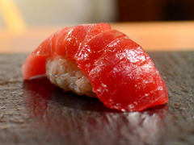

# SRMD ncnn Vulkan


ncnn implementation of SRMD super resolution.

srmd-ncnn-vulkan uses [ncnn project](https://github.com/Tencent/ncnn) as the universal neural network inference framework.

## [Download](https://github.com/nihui/srmd-ncnn-vulkan/releases)

Download Windows/Linux/MacOS Executable for Intel/AMD/Nvidia GPU

**https://github.com/nihui/srmd-ncnn-vulkan/releases**

This package includes all the binaries and models required. It is portable, so no CUDA or Caffe runtime environment is needed :)

## Usages

### Example Command

```shell
srmd-ncnn-vulkan.exe -i input.jpg -o output.png -n 3 -s 2
```

### Full Usages

```console
Usage: srmd-ncnn-vulkan -i infile -o outfile [options]...

  -h                   show this help
  -v                   verbose output
  -i input-path        input image path (jpg/png/webp) or directory
  -o output-path       output image path (jpg/png/webp) or directory
  -n noise-level       denoise level (-1/0/1/2/3/4/5/6/7/8/9/10, default=3)
  -s scale             upscale ratio (2/3/4, default=2)
  -t tile-size         tile size (>=32/0=auto, default=0) can be 0,0,0 for multi-gpu
  -m model-path        srmd model path (default=models-srmd)
  -g gpu-id            gpu device to use (default=0) can be 0,1,2 for multi-gpu
  -j load:proc:save    thread count for load/proc/save (default=1:2:2) can be 1:2,2,2:2 for multi-gpu
  -x                   enable tta mode
  -f format            output image format (jpg/png/webp, default=ext/png)
```

- `input-path` and `output-path` accept either file path or directory path
- `noise-level` = noise level, large value means strong denoise effect, -1 = no effect
- `scale` = scale level, 2 = upscale 2x, 3 = upscale 3x, 4 = upscale 4x
- `tile-size` = tile size, use smaller value to reduce GPU memory usage, default selects automatically
- `load:proc:save` = thread count for the three stages (image decoding + waifu2x upscaling + image encoding), using larger values may increase GPU usage and consume more GPU memory. You can tune this configuration with "4:4:4" for many small-size images, and "2:2:2" for large-size images. The default setting usually works fine for most situations. If you find that your GPU is hungry, try increasing thread count to achieve faster processing.
- `format` = the format of the image to be output, png is better supported, however webp generally yields smaller file sizes, both are losslessly encoded

If you encounter a crash or error, try upgrading your GPU driver:

- Intel: https://downloadcenter.intel.com/product/80939/Graphics-Drivers
- AMD: https://www.amd.com/en/support
- NVIDIA: https://www.nvidia.com/Download/index.aspx

## Sample Images

### Original Image



### Upscale 4x with ImageMagick Lanczo4 Filter

```shell
convert origin.jpg -resize 400% output.png
```


### Upscale 4x with waifu2x scale=2 model=upconv_7_photo twice

```shell
waifu2x-ncnn-vulkan.exe -i origin.jpg -o 2x.png -s 2 -m models-upconv_7_photo
waifu2x-ncnn-vulkan.exe -i 2x.png -o 4x.png -s 2 -m models-upconv_7_photo
```


### Upscale 4x with srmd noise=3 scale=4

```shell
srmd-ncnn-vulkan.exe -i origin.jpg -o output.png -n 3 -s 4
```


## Original SRMD Project

- https://github.com/cszn/SRMD
- https://github.com/cszn/KAIR

## Other Open-Source Code Used

- https://github.com/Tencent/ncnn for fast neural network inference on ALL PLATFORMS
- https://github.com/webmproject/libwebp for encoding and decoding Webp images on ALL PLATFORMS
- https://github.com/nothings/stb for decoding and encoding image on Linux / MacOS
- https://github.com/tronkko/dirent for listing files in directory on Windows
